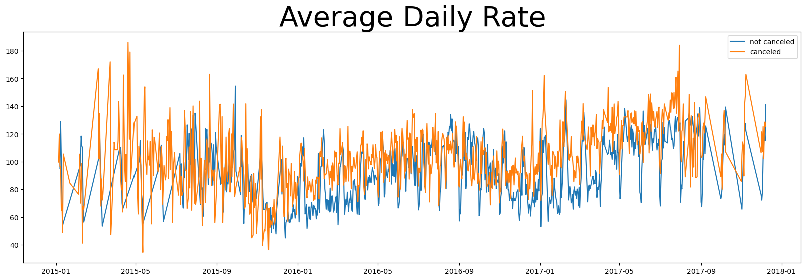
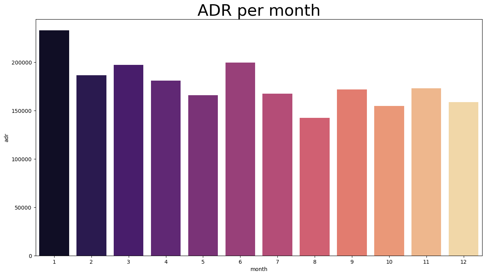
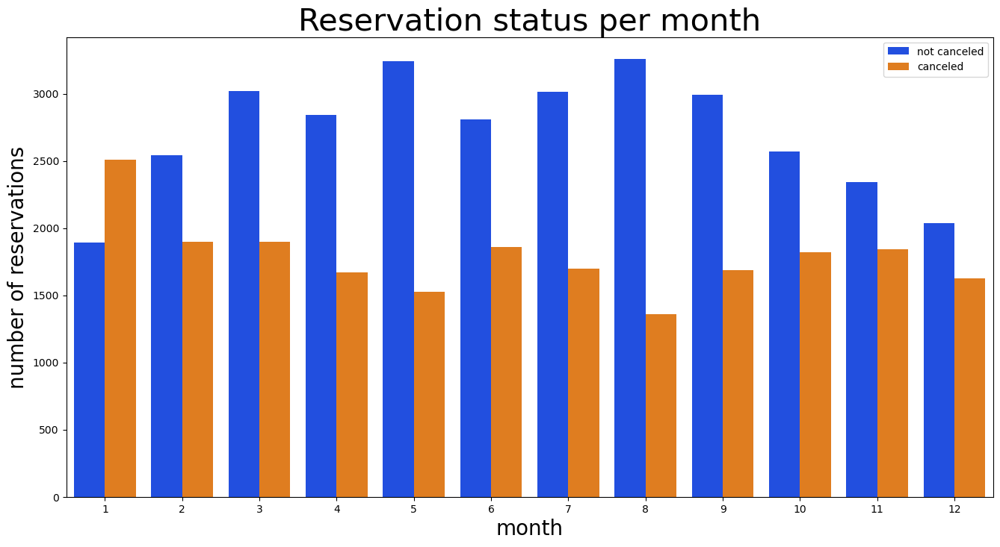
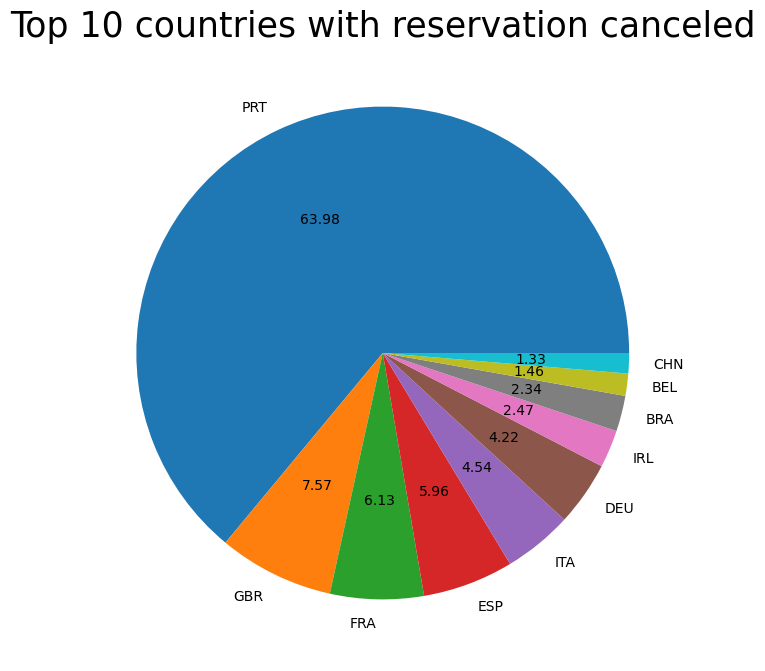

# 🏨 Hotel Booking Data Analysis & Insights

## Project Overview
This project analyzes hotel booking data to understand booking patterns and cancellation behavior. The analysis was performed using Python for data cleaning and exploratory data analysis, and Power BI for dashboard visualization.

## Tools and Technologies
### 📊 Data Analysis & Manipulation  
<div align="center">
  
  
  
</div>

### 📈 Data Visualization & BI  
<div align="center">
  
  
  
</div>

### 📓 Environment & IDE  
<div align="center">
  
  
</div>

## Project Steps
1. Data Cleaning and Preprocessing using Python
2. Exploratory Data Analysis (EDA)
3. Data Visualization using Matplotlib and Seaborn
4. Creation of an interactive dashboard in Power BI

## Key Insights
- City hotels show a higher number of bookings and cancellations compared to resort hotels.
- Booking demand varies significantly across different months.
- A few countries contribute the majority of hotel bookings.
- Cancellation patterns help identify potential areas to improve booking management.

## 📊 Analytics Dashboard
An interactive Power BI dashboard was created to visualize:
- Monthly booking trends
- Cancellation distribution
- Hotel type comparison
- Top countries by booking or cancellation

## Dataset
The dataset used in this project is the **Hotel Booking Demand Dataset**, commonly available on Kaggle for data analysis practice.


## 📂 Project Structure
```text
├── hotel_booking.zip/                        # Raw datasets
├── Hotel Booking cleaned.csv/                # Cleaned datasets
├── hotel_booking_analysis.ipynb              # Jupyter Notebook for Python Analysis
├── report of Hotel Booking Analysis.pdf/     # Data report in pdf
├── images/                                   # All visualizations used in this README
└── README.md                                 # Project documentation
```

## graphs
### 1. Revenue Analysis (Average Daily Rate)
The Average Daily Rate (ADR) fluctuates significantly throughout the year, peaking during the summer months for Resort hotels while staying more consistent for City hotels.

<div align="center">
  
</div>

### 2. Revenue Analysis (Average Daily Rate)
The Average Daily Rate (ADR) fluctuates significantly throughout the year. As shown in the graph below, Resort hotels see a massive spike during the summer months (July/August), while City hotels maintain a more stable pricing structure.

<div align="center">
  
</div>

### 3. Reservation Volume Trends
This visualization illustrates the daily reservation patterns throughout the months. It highlights specific peaks in booking activity, allowing for better staffing and inventory management.

<div align="center">
  
</div>


### 6. Geographical Analysis (Top 10 Countries)
The vast majority of bookings originate from European countries, with Portugal (PRT) being the most significant market. This insight allows for region-specific marketing and personalized service offerings based on guest origin.

<div align="center">
  
</div>

## sample Dashborad


## 📊 Analytics Dashboard

The dashboard provides a 360-degree view of hotel operations. It allows for dynamic filtering based on hotel types, guest demographics, and booking status.

<div align="center">
  
  <p><i>Figure 1: Daily Reservation Volume Trends Across Different Months</i></p>
</div>

### 💎 Key Performance Indicators (KPIs)

| 📅 Total Bookings | ❌ Cancellation Rate | 💰 Avg Daily Rate (ADR) | 🌍 Top Market |
| :---: | :---: | :---: | :---: |
| **119,390** | **37.04%** | **€101.83** | **Portugal (PRT)** |

---

## 🔍 Visual Deep-Dive

<table border="0">
  <tr>
    <td>
      
      <p align="center"><b>Revenue Seasonality</b><br/>Tracking ADR spikes in Resort vs City Hotels</p>
    </td>
    <td>
      
      <p align="center"><b>Geographic Market</b><br/>Top 10 Guest Origin Countries</p>
    </td>
  </tr>
</table>

---

## 🎯 Key Insights & Findings

> [!IMPORTANT]
> **Cancellation Alert:** City hotels experience significantly higher cancellation rates (41%) compared to Resort hotels (27%). This suggests a need for stricter deposit policies in urban areas.

* **Pricing Strategy:** The **Average Daily Rate (ADR)** peaks drastically in August for resorts, indicating high seasonal demand that can be leveraged for early-bird promotions.
* **Customer Origin:** Portugal (PRT) is the primary market. Expanding marketing efforts to Great Britain (GBR) and France (FRA) could further diversify the guest portfolio.
* **Booking Lead Time:** Analysis shows that bookings made over 4 months in advance have a higher likelihood of being cancelled.

---

## 🚀 Project Workflow
1.  **Data Preprocessing**: Handled missing values in `children`, `country`, and `agent` columns. Removed outliers in `ADR` to ensure statistical accuracy.
2.  **Exploratory Data Analysis (EDA)**: Investigated the relationship between lead time, deposit type, and cancellation status.
3.  **Visualization**: Built custom Seaborn and Matplotlib charts for static reporting.
4.  **Dashboarding**: Consolidated all cleaned data into Power BI for interactive stakeholder viewing.

---

